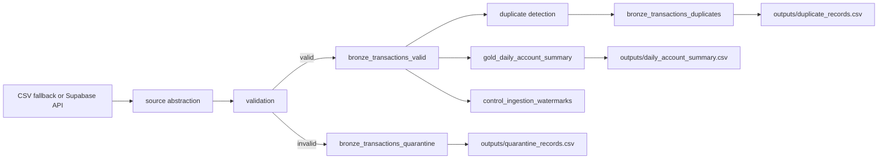

# Architecture

The pipeline separates source extraction, validation, storage, transformation, and watermark control. CSV and API clients return the same logical record shape through `src/source.py`, so downstream validation and persistence do not depend on the source.

Validation runs against the provided Draft-07 schema after source normalization for CSV amount strings and API `+00:00` timestamps. Python validation supplements the schema for assigned ISO country codes and source-metadata handling such as Supabase's internal `id`.

The bronze layer preserves valid records with only minimal normalization: timestamps are normalized to UTC and amounts are parsed as decimals. Invalid records go to a quarantine table with the full raw payload and all validation errors, which keeps rejected data auditable.

Duplicates are not dropped from bronze. They are flagged using a natural-key hash and mirrored to `bronze_transactions_duplicates`. The gold layer is curated from completed, non-duplicate bronze rows only.

Watermark state is stored in DuckDB in `control_ingestion_watermarks`. Incremental loads use a configurable lookback window to handle late-arriving data while transaction-id upserts keep reprocessing idempotent.
