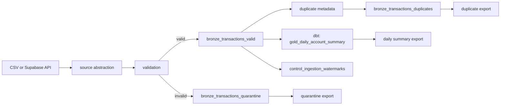

# Local Design And Operations

This document keeps the local architecture, data quality behavior, and troubleshooting notes in one place. The README is the quick reviewer path; this file is the deeper local reference.

## Architecture



The pipeline separates source extraction, validation, persistence, transformation, and operational control:

- `src/source.py` hides whether records come from CSV or the Supabase REST API.
- `src/validation.py` applies the provided JSON Schema plus checks that need Python logic.
- DuckDB stores bronze, quarantine, duplicate, control, and gold tables locally.
- dbt builds the curated daily account summary and runs model tests.
- JSON/CSV artifacts under `outputs/` make the run easy to inspect without opening DuckDB.

## Design Choices

### Validation And Quarantine

Validation is schema-first. CSV amount strings and API `+00:00` timestamps are normalized before validation so both sources produce the same downstream shape. Supabase's internal `id` is treated as source metadata; other unexpected fields are rejected.

Invalid records are not dropped. They are written to `bronze_transactions_quarantine` with the raw payload, all validation errors, source, batch ID, and ingestion timestamp.

### Duplicate Handling

Business duplicates are detected by hashing all natural transaction fields except `transaction_id` and API `id`. All valid records remain in bronze for auditability. The canonical row has `duplicate_rank = 1`; later rows in the same natural-key group are flagged as duplicates and excluded from gold.

### Incremental Watermark

The control table stores the latest successful transaction timestamp. Incremental runs subtract `WATERMARK_LOOKBACK_DAYS` before reading again, so late-arriving records near the previous watermark can still be picked up. Upserts by `transaction_id` keep repeated lookback processing idempotent.

### Daily Summary

`gold_daily_account_summary` includes completed, non-duplicate transactions only. It groups by account and UTC date, then calculates debit total, credit total, net amount, transaction count, distinct merchants, top spend category, currencies, and update time.

`top_category` is based on completed debit spend only. Credit-only days have no top spend category. No FX conversion is performed locally; multi-currency account/date groups are exposed through the `currencies` column and counted in `outputs/data_profile.json`.

## Data Quality Snapshot

After `make run` with the assignment dataset:

| Metric | Value |
| --- | ---: |
| Source records read | 352 |
| Valid records persisted | 349 |
| Quarantined records | 3 |
| Duplicate business transactions flagged | 5 |
| Canonical valid records | 344 |
| Daily account summary rows | 257 |
| Distinct accounts | 20 |
| Valid transaction date range | `2024-01-01T21:38:24Z` to `2024-03-30T22:35:29Z` |
| Multi-currency account/date groups | 17 |

The built-in incremental simulation rereads 9 rows from the two-day lookback window, validates 7, reprocesses 2 already-known invalid rows, inserts 0 new valid records, and keeps the watermark at `2024-03-30T22:35:29Z`.

For generated details, inspect:

- `outputs/data_profile.json`
- `outputs/data_quality_assertions.json`
- `outputs/metrics.json`
- `outputs/run_summary.json`

## Troubleshooting

| Symptom | First checks |
| --- | --- |
| Ingestion fails | Confirm `TRANSACTIONS_SOURCE`, local data files, API key if using API mode, and `PAGE_LIMIT`. |
| High quarantine rate | Inspect `outputs/quarantine_records.csv` and group by `error_reason`. Common causes are missing fields, bad timestamps, invalid enum casing, non-positive amounts, and invalid country codes. |
| Duplicate rate spikes | Inspect `outputs/duplicate_records.csv`. A spike can indicate source replay, API pagination issues, or upstream retry behavior. |
| Watermark does not advance | Check `outputs/watermark_run*.json` and `outputs/run_summary.json`. This is expected when no newer valid records arrive. |
| dbt or assertion failure | Run `make dbt-run`, `make dbt-test`, then inspect dbt output and `outputs/data_quality_assertions.json`. |

Local recovery is intentionally simple:

```bash
make clean
make run
```

For API connectivity only:

```bash
TRANSACTIONS_SOURCE=api TRANSACTIONS_API_KEY=your-token make api-smoke
```

## Local Scope Tradeoffs

Some choices are intentionally simple for this local assignment:

- API extraction uses deterministic ordering plus offset pagination because the provided Supabase endpoint is only an optional source path. In production, use cursor/keyset pagination when the source supports it.
- CSV header normalization is deliberately conservative: trim and lowercase headers, but do not silently map broad aliases. Unexpected schema drift should fail validation instead of being hidden.
- Duplicate metadata is recomputed across the local bronze table after ingestion. This is simple and auditable for the assignment scale; production should use incremental `MERGE` logic and first-seen/last-seen metadata.
- `data_profile.json` derives invalid-rule counts from the local quarantine error string. Production quarantine should store structured error arrays for safer analytics.
